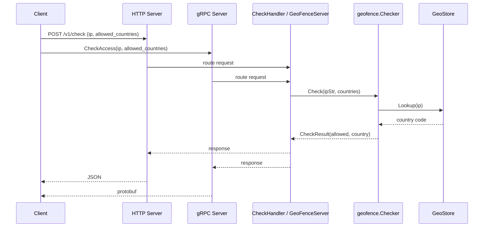

## AVOXI Geo-Fence Service

A high-performance microservice designed to determine if a specific IP address is allowed access based on a country whitelist. Built with Go 1.25+ and the MaxMind GeoLite2 database.

#### Video Overview
https://www.loom.com/share/0af100a00e854576a1074587f5fd9944

#### Architecture

The service exposes both HTTP and gRPC transports, sharing the same GeoStore and business logic:


**Request flow** – how a check request moves through the system:



#### Prerequisites

- **Go:** 1.25 or higher (for local development)
- **MaxMind database:** Place `GeoLite2-Country.mmdb` in the `data/` directory. See [data/README.md](data/README.md) for download instructions.

#### Quick Start in isolation (quick tests on your local machine).

```bash
make run          # Build and run locally (HTTP :8080, gRPC :9090)
make docker-run   # Build and run in Docker (use -p 8080:8080 -p 9090:9090)
```

For Kubernetes (Kind), create a cluster once, then deploy (good for production environments or microservices):

```bash
make kind-cluster   # One-time: create Kind cluster
make k8s-up         # Build, load image, deploy
make k8s-forward    # Port-forward to localhost:8080
```

Run `make help` for all available commands.

#### Environment Variables

| Variable  | Default                       | Description                             |
| --------- | ----------------------------- | --------------------------------------- |
| HTTP_PORT | 8080                          | HTTP server port                        |
| GRPC_PORT | 9090                          | gRPC server port                        |
| APP_PORT  | (fallback if HTTP_PORT unset) | Alternative for HTTP port               |
| PORT      | (fallback if APP_PORT unset)  | Alternative for Heroku, Cloud Run, etc. |
| DB_PATH   | data/GeoLite2-Country.mmdb    | Path to GeoLite2-Country.mmdb           |
| LOG_LEVEL | info                          | Log level: debug, info, warn, error     |

#### Testing Both Servers

**HTTP (port 8080)**

```bash
# Good request
curl -X POST http://localhost:8080/v1/check \
  -H "Content-Type: application/json" \
  -d '{"ip_address": "8.8.8.8", "allowed_countries": ["US", "CA"]}'

# Good request with grpc
grpcurl -plaintext -d '{"ip_address":"8.8.8.8","allowed_countries":["US","CA"]}' \
  localhost:9090 geofence.v1.GeoFenceService/CheckAccess

# Bad request (invalid IP) - returns 400
curl -X POST http://localhost:8080/v1/check \
  -H "Content-Type: application/json" \
  -d '{"ip_address": "not-an-ip", "allowed_countries": ["US"]}'

# Health endpoints
curl http://localhost:8080/health
curl http://localhost:8080/ready
```

**gRPC (port 9090)** – requires [grpcurl](https://github.com/fullstorydev/grpcurl) (`go install github.com/fullstorydev/grpcurl/cmd/grpcurl@latest`)

```bash
# List services
grpcurl -plaintext localhost:9090 list

# CheckAccess
grpcurl -plaintext -d '{"ip_address":"8.8.8.8","allowed_countries":["US","CA"]}' \
  localhost:9090 geofence.v1.GeoFenceService/CheckAccess

# CheckHealth
grpcurl -plaintext -d '{}' localhost:9090 geofence.v1.HealthService/CheckHealth
```
